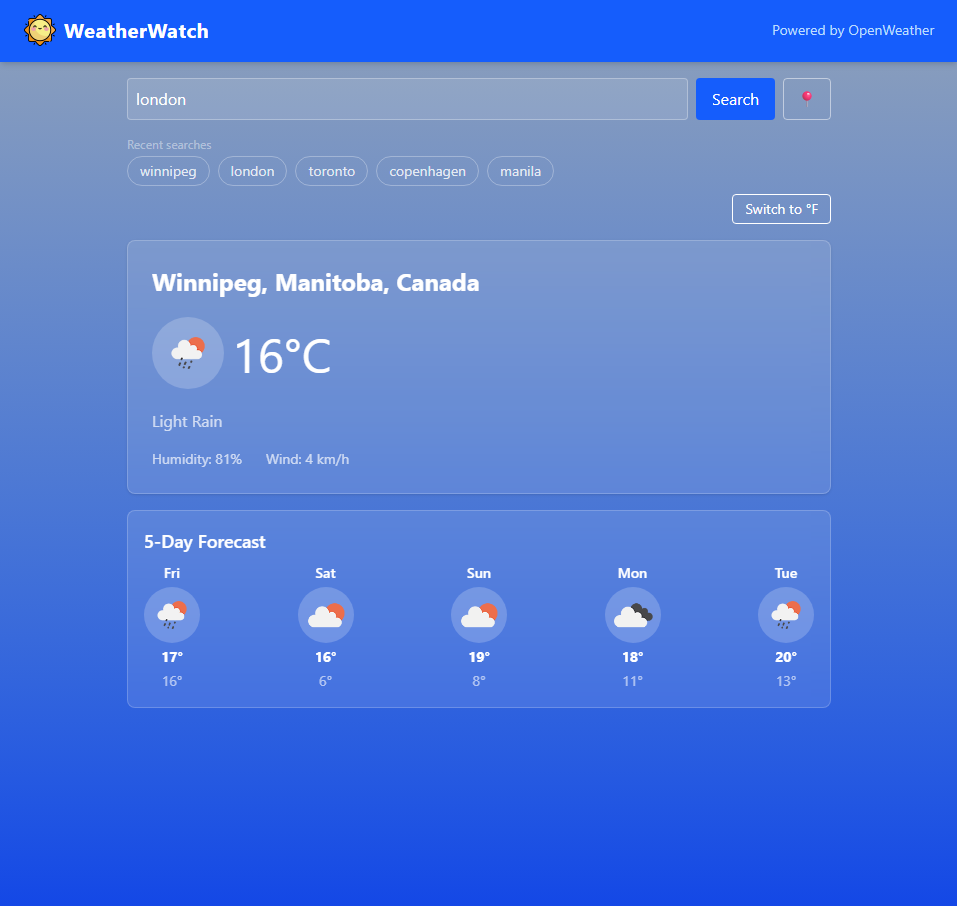
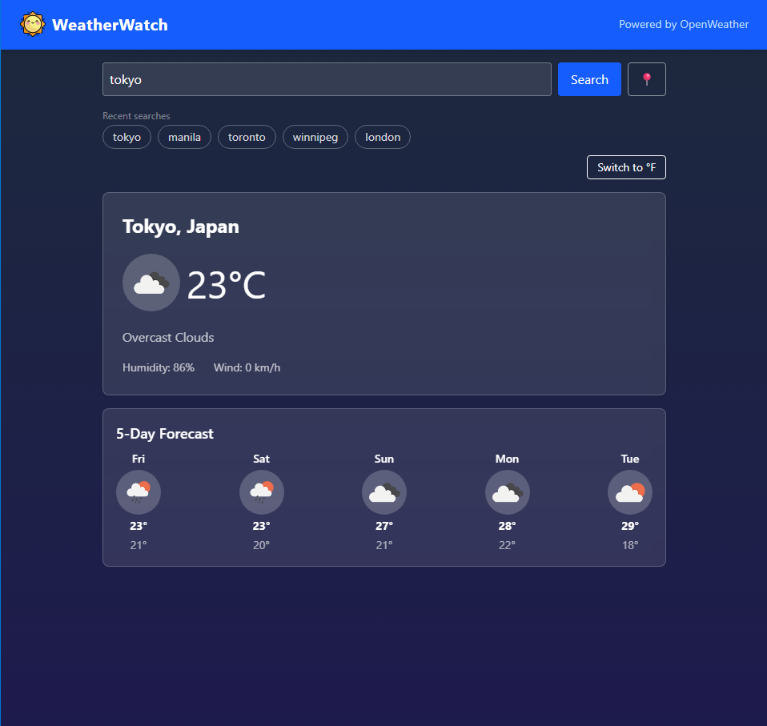
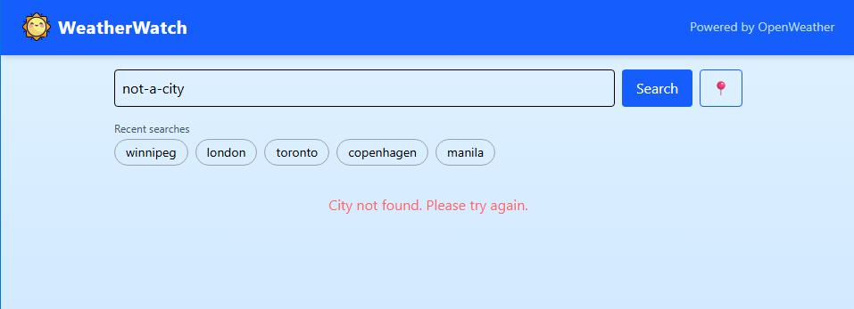

#  WeatherWatch 

> *An easy-to-use website to provide you with relevant weather details for any city in the world*

**[Link to website](https://weather-watch-two.vercel.app/)**

## Preview
 



 
*Current weather conditions along with 5-day forecast.*


 
*Results when an invalid city is inputted.*

## Features

- Search current weather conditions for any city
- 5-day forecast with weather icons
- Toggle between Celsius and Fahrenheit
- Auto-detect weather based on your current location
- Graceful error handling for invalid cities
- Search history to easily go back to previously searched cities
- Loading states during data fetching
- Background that changes based on weather conditions and time of day

## About

A full stack weather dashboard that delivers real-time weather conditions and 5-day forecasts for any city in the world. The purpose of this project was to practice full-stack development using popular frameworks such as React and Node.js, along with gaining experience in REST API integration and cloud deployment. 

## Tech Stack

**Frontend**
- React
- Tailwind CSS

**Backend**
- Node.js
- Express.js
- Axios

**APIs & Deployment**
- OpenWeatherMap API
- Vercel (frontend hosting)
- Render (backend hosting)

## How It Works

All elements on the website are displayed using the React frontend which is hosted on Vercel. When the user inputs a city to fetch the weather data from, this request is routed through the Express backend and the data is retrieved from the OpenWeatherMap API. This workflow secures the API key and allows the backend to transform the raw response into a clean format before passing it to the frontend.

```
Browser → React Frontend (Vercel)
               ↓
         Express Backend (Render)
               ↓
         OpenWeatherMap API
```


## Getting Started
You can simply use the website by clicking the link provided above or you can also run it locally. The steps to run it locally are outlined below. 
### Prerequisites
- Node.js installed on your machine
- A free OpenWeatherMap API key from [openweathermap.org](https://openweathermap.org)

### Installation

1. Clone the repository:
```bash
git clone https://github.com/HerrerAaron/weatherwatch.git
cd weatherwatch
```

2. Install frontend dependencies:
```bash
cd frontend
npm install
```

3. Install backend dependencies:
```bash
cd ../backend
npm install
```

4. Create a `.env` file in the `backend` folder:
```
OPENWEATHER_API_KEY=your_api_key_here
```

5. Create a `.env.local` file in the `frontend` folder, so the frontend talks to your local backend instead of the deployed one:
```
VITE_API_URL=http://localhost:5000
```

6. Start the backend server:
```bash
node server.js
```

7. In a separate terminal, start the frontend:
```bash
cd frontend
npm run dev
```

8. Open your browser at `http://localhost:5173`

## Environment Variables

**Backend** (`.env`) — required to run the backend:

| Variable | Description |
|---|---|
| `OPENWEATHER_API_KEY` | Your OpenWeatherMap API key |

**Frontend** (`.env.local`) — optional; without it, the frontend falls back to the deployed Render backend:

| Variable | Description |
|---|---|
| `VITE_API_URL` | Base URL of the backend the frontend should call (e.g. `http://localhost:5000` for local development) |

## Deployment

The frontend is deployed on **Vercel** and the backend is deployed on **Render**. Any push to the `main` branch automatically triggers a redeployment on both platforms.

## What I'd Improve Next

- Add more useful features. E.g. precipitation, sunrise/sundown, time-based forecasts
- Ability to pin/save cities so users can quickly check weather conditions without having to search for it on first launcgh

## Author
**Aaron Herrera** — [GitHub](https://github.com/HerrerAaron) • [LinkedIn](https://www.linkedin.com/in/aaronherrera4/)

## Credits
Website logo: <a href="https://www.flaticon.com/free-icons/smile" title="smile icons">Smile icons created by Freepik - Flaticon</a>